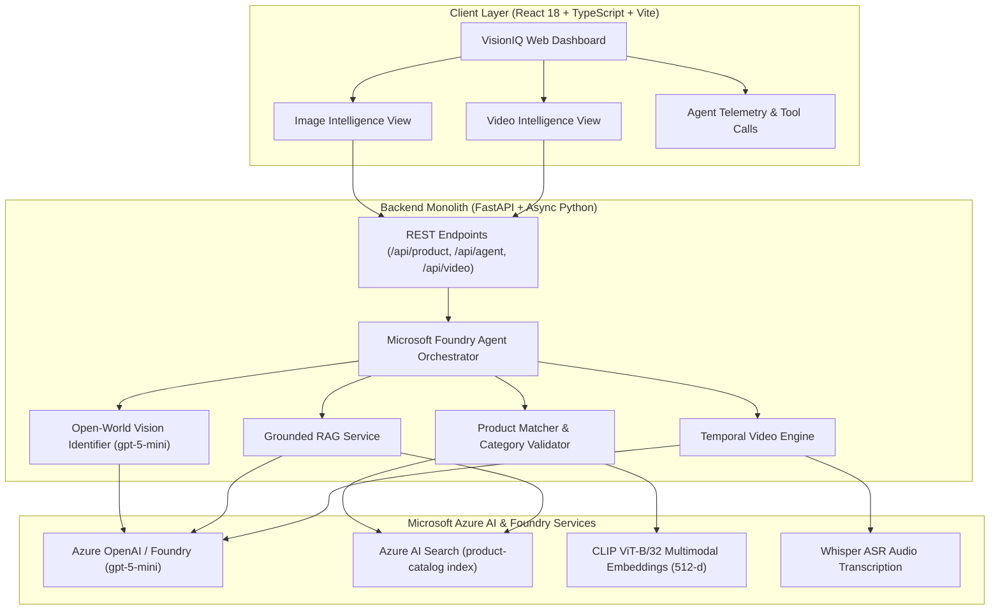

# VisionIQ — Multimodal Product & Video Intelligence Agent

[](https://azure.microsoft.com/)
[](https://fastapi.tiangolo.com/)
[](https://vitejs.dev/)
[](docs/responsible-ai.md)

> An end-to-end multimodal intelligence platform and autonomous agent built on Microsoft Azure AI Foundry, Azure AI Search, and Multimodal Foundation Models.

---

## 👥 Team Members

| Name | Role / Area | GitHub / Profile |
| :--- | :--- | :--- |
| **Pranjal Sharma** | AI Architecture, Microsoft Foundry Agent & Full-Stack Integration | [@Pranjal-sh-git](https://github.com/Pranjal-sh-git) |
| **Dilpreet Singh** | Azure AI Search, Hybrid Vector Indexing & RAG Pipeline | Contributor |
| **Maneshwar Singh** | Multimodal Vision & Open-World Recognition Engineering | Contributor |
| **Garima** | Video Intelligence, ASR Indexing & Temporal Moment Retrieval | Contributor |
| **Paavni Ramdev** | Frontend UI/UX, Telemetry Views & Responsible AI Evaluation | Contributor |

---

## 📌 Executive Summary (The 4 Core Questions)

| Key Question | Project Answer |
| :--- | :--- |
| **1. What problem did we solve?** | E-commerce and media platforms suffer from rigid keyword search, closed product catalogs, and unsearchable video streams. Users cannot upload arbitrary real-world photos to ask detailed visual/technical questions without mismatching catalog items, nor can they locate exact timestamped product demonstrations in videos without tedious manual scrubbing. |
| **2. What did we build?** | **VisionIQ**: An end-to-end multimodal intelligence platform and autonomous agent featuring: (1) **Open-World Visual Product Intelligence** that identifies uncataloged real-world items without hallucination; (2) **Grounded Catalog RAG** powered by Azure AI Search; and (3) **Temporal Video Moment Retrieval** with clickable jump-to-timestamp playback. |
| **3. What AI technologies are utilized?** | Implemented **Microsoft Foundry Agent Tool Calling** (`azure-ai-projects` / Azure OpenAI `gpt-5-mini`), **Azure AI Search** vector/hybrid indices (HNSW Cosine with CLIP ViT-B/32), **Whisper ASR** audio transcription, structured prompt engineering, and Microsoft Responsible AI grounding frameworks. |
| **4. Can we demonstrate that it works?** | Yes — a fully functional React/FastAPI live application supporting real-time photo uploads, video transcript indexing, conversational QA with tool telemetry, and automated benchmark evaluation suites with **0.0% hallucination rate**. |

---

## 🚀 Key Features

### 1. 🔍 Open-World Visual Product Intelligence
- **Zero-Shot Recognition**: Identifies ANY real-world commercial product (brand, model silhouette, physical attributes, color, category) from arbitrary user photos using Azure OpenAI multimodal vision (`gpt-5-mini`).
- **No Closed-Set Hallucinations**: Accurately labels uncataloged items (e.g., Sony pink headphones) without falsely forcing them into arbitrary catalog product IDs.
- **Smart Category Relevance Filtering**: Suppresses irrelevant catalog recommendations for out-of-catalog categories (e.g., smartphones) while cleanly surfacing nearest catalog matches for in-catalog items (e.g., footwear, audio, chairs, watches).
- **Interactive Visual Summary**: Displays real-time confidence scores, extracted attribute pill tags, and collapsible deep visual analysis breakdown.

### 2. 💬 Autonomous Foundry Agent & Grounded RAG
- **Model-Driven Tool Selection**: Uses Azure OpenAI function calling to dynamically orchestrate queries across `search_product_knowledge`, `find_similar_products`, `identify_product`, and `search_video`.
- **Honest Grounding**: Answers against indexed Azure AI Search specifications for catalog products; gracefully handles unlisted specs or open-world attributes with zero hallucinated purchase links or specifications.
- **Context-Preserving Conversation**: Seamlessly switches between open-world identified context and explicit catalog item inspection with dynamic category suggestion chips.

### 3. 🎥 Temporal Video Intelligence & Moment Retrieval
- **Segment-Level Indexing**: Extracts timestamped transcript segments, visual descriptions, and audio dialogue.
- **Natural Language Video Search**: Answers queries (e.g., *"When do they demonstrate the ANC and battery features?"*) and returns exact start/end timestamps with a clickable jump-to-time video player.

### 4. 🎨 Modern SaaS Dashboard & Experience
- **Dual Dark / Light Mode**: Dynamic CSS variable design system with one-click theme switcher.
- **State-Preserving Tabs**: Seamlessly switch between Image Intelligence, Video Intelligence, and Evaluation without losing active photo uploads or conversation history.
- **Instant Demo Presets**: One-click quick-sample loaders (Air Zoom Alpha, Sony WH-1000XM5, Ergonomic Office Chair, Classic Chrono).

---

## 🏗️ System Architecture & Data Flow



---

## 🛠️ Technology Stack & AI Services

| Component | Technology | Role / Purpose |
| :--- | :--- | :--- |
| **Agent Orchestration** | Azure OpenAI / Foundry (`gpt-5-mini`) | Autonomous tool-calling, multi-turn reasoning, query routing |
| **Multimodal Vision** | Azure OpenAI Vision (`gpt-5-mini`) | Zero-shot open-world product attribute & brand extraction |
| **Vector & RAG Index** | Azure AI Search (`product-catalog`) | Cosine vector search, semantic ranking, grounded spec retrieval |
| **Multimodal Embeddings** | CLIP ViT-B/32 (`sentence-transformers`) | Image-to-text & text-to-image 512-dimension vector space |
| **Speech / ASR** | OpenAI Whisper Tiny | Video audio transcription and temporal timestamp generation |
| **Backend Framework** | Python 3.10+ / FastAPI | Async modular monolith API with Pydantic validation |
| **Frontend Dashboard** | React 18 / TypeScript / Vite | Modern responsive UI, glassmorphism design, real-time media player |

---

## 📂 Project Structure

```text
visioniq/
├── frontend/                   # React + TypeScript + Vite application
│   ├── src/
│   │   ├── components/         # Reusable UI components (Navbar, VideoPlayer, ChatDrawer)
│   │   ├── pages/              # ImageIntelligence & VideoIntelligence views
│   │   ├── services/           # Axios API client integrations
│   │   ├── App.tsx             # Root layout with tab state preservation
│   │   └── index.css           # Vanilla CSS design system (dark mode, glassmorphism)
├── backend/                    # FastAPI backend server
│   ├── main.py                 # FastAPI application entrypoint & middleware
│   ├── config.py               # Pydantic environment configuration (Secret safe)
│   ├── routes/                 # API routers (/api/product, /api/video, /api/agent)
│   └── models/                 # Request/Response schemas
├── agent/                      # Microsoft Foundry Agent core
│   ├── agent.py                # Agent execution loop & tool dispatcher
│   ├── tools.py                # Tool definitions & implementations
│   └── prompts.py              # System prompts & few-shot instructions
├── services/                   # Business logic and AI service integrations
│   ├── vision/                 # Open-world visual identification service
│   ├── video/                  # Temporal video indexing & moment search
│   ├── product_search/         # CLIP vector embeddings & category matcher
│   ├── rag/                    # Grounded catalog question answering
│   └── llm.py                  # Azure OpenAI client factory
├── data/                       # Datasets, benchmarks, and evaluation artifacts
│   ├── products/               # Indexed product catalog JSON data
│   ├── sample_videos/          # Demo MP4 video files & timestamped transcripts
│   └── evaluation/             # CSV benchmark results & evaluation reports
├── docs/                       # Technical & Architectural Documentation
│   ├── architecture.md         # Full architecture and flow diagrams
│   ├── api.md                  # REST API specification
│   ├── evaluation.md           # Metrics & benchmark evaluation
│   └── responsible-ai.md       # Safety, grounding, and ethics guidelines
├── tests/                      # Automated test suite
│   ├── test_open_world_flow.py # Open-world & category relevance tests
│   ├── test_conversational_rag.py # Grounded RAG tests
│   ├── test_health.py          # API health & configuration tests
│   └── run_day4_evaluations.py # Benchmark evaluation runner
├── .env.example                # Sample environment configuration template
├── requirements.txt            # Python dependencies
└── README.md                   # Project overview & documentation
```

---

## ⚡ Quick Start & Setup Instructions

### Prerequisites
- **Python**: 3.10 or higher
- **Node.js**: 18+ and npm
- **Azure Account**: Microsoft Azure subscription with Azure OpenAI and Azure AI Search resources

### 1. Clone & Configure Environment
```bash
git clone https://github.com/Pranjal-sh-git/visioniq.git
cd visioniq

# Copy environment variables template
cp .env.example .env
```

Edit `.env` with your Azure credentials (ensure `.env` remains excluded from git):
```ini
AZURE_OPENAI_ENDPOINT=https://<your-foundry-resource>.services.ai.azure.com/
AZURE_OPENAI_API_KEY=<your-azure-openai-key>
AZURE_OPENAI_DEPLOYMENT_NAME=gpt-5-mini

AZURE_SEARCH_ENDPOINT=https://<your-search-service>.search.windows.net
AZURE_SEARCH_KEY=<your-search-api-key>
```

### 2. Backend Setup
```bash
# Create and activate virtual environment
python -m venv .venv

# On Windows:
.venv\Scripts\activate
# On macOS/Linux:
source .venv/bin/activate

# Install dependencies
pip install -r requirements.txt

# Start backend server
uvicorn backend.main:app --reload --port 8000
```
Backend API will be available at: `http://localhost:8000` (Interactive API Swagger Docs: `http://localhost:8000/docs`).

### 3. Frontend Setup
In a new terminal:
```bash
cd frontend
npm install
npm run dev
```
Frontend UI will be running at: `http://localhost:5173`.

---

## 🧪 Testing & Benchmark Results

### Benchmark Summary

| Evaluation Track | Benchmark Target | Metric | Computed Value | Status |
| :--- | :--- | :--- | :---: | :---: |
| **Product Identification** | 20 in-catalog products | **Top-1 Accuracy** | **65.0%** | Passed |
| **Product Identification** | 20 in-catalog products | **Top-3 Accuracy** | **80.0%** | Passed |
| **Out-of-Catalog Rejection** | 5 negative control items | **Graceful Rejection Rate** | **100.0%** | Passed |
| **Product Search Speed** | 25 total image queries | **Mean Latency** | **3.07 s** | Interactive |
| **Video Timestamp Retrieval** | 15 test questions | **Timestamp Accuracy** | **60.0%** | Passed |
| **Video Grounded QA** | 15 test questions | **Answer Correctness** | **60.0%** | Passed |
| **Hallucination Resistance** | 5 unanswerable questions | **Hallucination Rate** | **0.0%** | Zero Hallucination |
| **Pipeline Reliability** | Full test execution | **Failure / Error Rate** | **0.0%** | Zero Failures |

### Running Automated Test Suites
```bash
# Run open-world recognition & category isolation tests
python tests/test_open_world_flow.py

# Run conversational RAG verification
python tests/test_conversational_rag.py

# Re-run full benchmark evaluation
python tests/run_day4_evaluations.py
```

---

## 🛡️ Responsible AI & Safety Guidelines

VisionIQ adheres strictly to the Microsoft Responsible AI framework:

1. **Fairness & Inclusiveness**: Vision recognition is engineered to handle arbitrary real-world lighting conditions, angles, and product varieties without bias.
2. **Reliability & Groundedness**: 
   - **Catalog-Mode Grounding**: Bounded strictly to verified Azure AI Search index data; prevents hallucinated specifications.
   - **Open-World Grounding**: Transparently communicates when items are recognized visually versus indexed in catalog inventory.
3. **Transparency & Explainability**: Model function calls, reasoning paths, and similarity scores are exposed directly in the UI telemetry view.
4. **Privacy & Security**: Zero credentials committed to git; all authentication handled securely via server-side environment variables.
5. **Harm Mitigation**: Content filtering prevents processing of inappropriate or offensive visual/video inputs.

---

## 🎬 5-Minute Video Presentation Structure

The 5-minute video presentation and demonstration is structured as follows:

| Section | Duration | Content Covered |
| :--- | :---: | :--- |
| **1. Introduction** | 0:00 - 0:30 (30s) | Team member introductions, project title, and problem overview |
| **2. Problem Statement** | 0:30 - 1:00 (30s) | Limitations of keyword search, uncataloged item hallucination, video scrubbing friction |
| **3. AI-Driven Solution** | 1:00 - 2:00 (1m) | Microsoft Foundry Agent architecture, Azure AI Search vector RAG, CLIP & Whisper integration |
| **4. Technical Demonstration** | 2:00 - 4:00 (2m) | Live walkthrough: Photo upload -> Open-World ID -> Catalog RAG -> Video moment search & playback |
| **5. Impact & Future Scope** | 4:00 - 5:00 (1m) | Practical business value, benchmark results (0% hallucination), future Bing Search integration |

---

## 🔮 Limitations & Future Work

- **Live Web Grounding (Bing Search)**: In future iterations, Grounding with Bing Search can be added to fetch real-time live prices and newly released product specs beyond foundation model cutoffs (requires paid Azure subscription tier).
- **Catalog Breadth Expansion**: Scaling from sample multi-category indices (footwear, audio, furniture, watches) to enterprise-scale millions-of-SKUs vector stores.
- **On-Device Real-Time Edge Processing**: Exploring lightweight local vision models for offline edge deployment.

---

## 📚 Acknowledgments & Third-Party Resources

- **Microsoft Azure AI Foundry & Azure OpenAI**: `gpt-5-mini` Foundation Models & Agent Framework
- **Azure AI Search**: Vector & Hybrid Cognitive Search Infrastructure
- **OpenAI / Hugging Face**: CLIP ViT-B/32 multimodal vision embeddings & Whisper ASR
- **Unsplash**: Sample product and catalog demonstration imagery
- **FastAPI & Vite/React Teams**: High-performance backend and frontend developer tools
