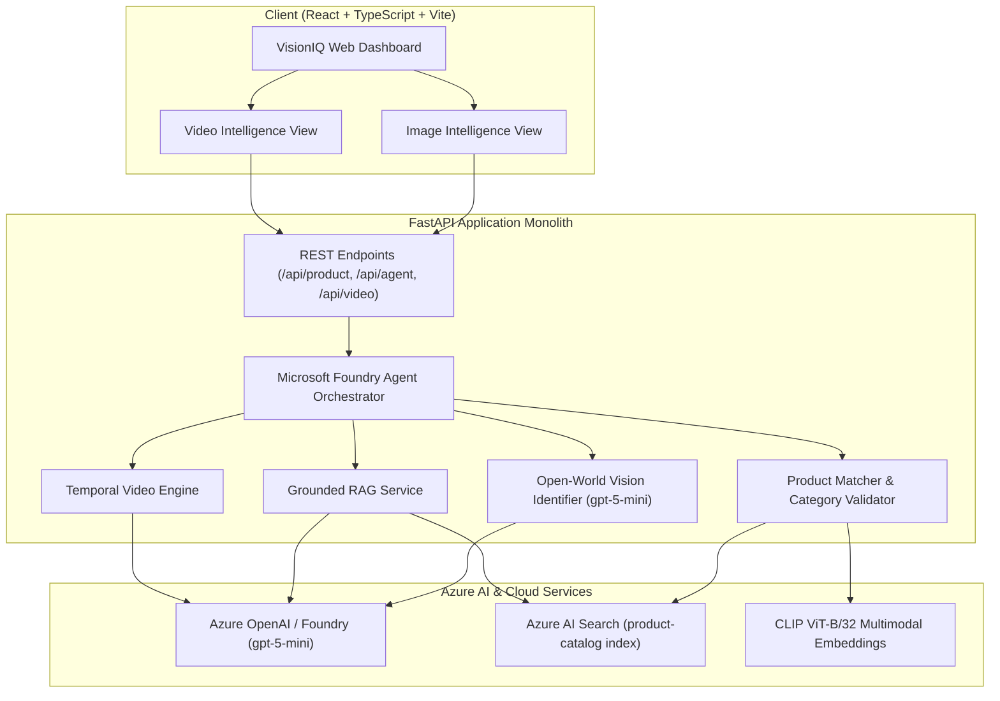

# VisionIQ — Multimodal Product & Video Intelligence Agent

[](https://azure.microsoft.com/)
[](https://fastapi.tiangolo.com/)
[](https://vitejs.dev/)
[](docs/responsible-ai.md)

> **AI-103: Develop AI Apps and Agents on Azure**  
> *Chitkara University & INBIOT — Group Project*

---

## 📌 Executive Summary

| Key Question | Summary |
| :--- | :--- |
| **1. What problem did we solve?** | Traditional commerce search and media analysis are limited to rigid keyword matching and closed databases. Users cannot ask contextual questions about arbitrary real-world products from uploaded photos or navigate to exact timestamped moments in product demonstration videos without tedious manual scrubbing. |
| **2. What did we build?** | **VisionIQ**: An end-to-end multimodal intelligence web application and autonomous agent that combines open-world visual product identification, semantic catalog recommendations, grounded RAG specification QA, and temporal video moment retrieval. |
| **3. How did we apply AI-103?** | Leveraged **Microsoft Foundry Agent Tool Calling**, **Azure OpenAI (`gpt-5-mini`)**, **Azure AI Search** vector & hybrid indexing, multimodal CLIP embeddings, and structured prompt engineering with strict Responsible AI grounding. |
| **4. Can we demonstrate it works?** | Yes — a fully functional React/FastAPI live application supporting real-time photo uploads, video transcript indexing, conversational QA with tool telemetry, and comprehensive automated test suites. |

---

## 👥 Team Members

- **Pranjal Sharma** (Lead Developer & AI Architecture)
- *AI-103 Group Project Team*

---

## 🚀 Key Features

### 1. 🔍 Open-World Visual Product Intelligence
- **Zero-Shot Recognition**: Identifies ANY real-world commercial product (brand, model silhouette, physical attributes, color, category) from arbitrary user photos using Azure OpenAI multimodal vision (`gpt-5-mini`).
- **No Closed-Set Hallucinations**: Accurately labels uncataloged items (e.g. Sony pink headphones) without falsely categorizing them as arbitrary catalog products.
- **Smart Category Relevance Filtering**: Suppresses irrelevant catalog recommendations for out-of-catalog categories (e.g. smartphones) while cleanly surfacing nearest catalog matches for in-catalog items (e.g. footwear, audio, chairs, watches).

### 2. 💬 Autonomous Foundry Agent & Grounded RAG
- **Model-Driven Tool Selection**: Uses Azure OpenAI function calling to intelligently route queries to `search_product_knowledge`, `find_similar_products`, `identify_product`, or `search_video`.
- **Honest Grounding**: Answers against indexed Azure AI Search specifications for catalog products; gracefully handles unlisted specs or open-world attributes with zero hallucinated purchase links or specs.
- **Context-Preserving Chat**: Seamlessly switches between open-world identified context and explicit catalog item inspection.

### 3. 🎥 Temporal Video Intelligence & Moment Retrieval
- **Segment-Level Indexing**: Extracts timestamped transcript segments, visual descriptions, and audio dialogue.
- **Natural Language Video Search**: Answers questions (e.g., *"When do they demonstrate the ANC and battery features?"*) and returns exact start/end timestamps with a clickable jump-to-time video player.

---

## 🏗️ System Architecture & Data Flow



---

## 🛠️ Technology Stack & AI Services

| Component | Technology | Role / Purpose |
| :--- | :--- | :--- |
| **Agent Orchestration** | Azure OpenAI / Foundry (`gpt-5-mini`) | Tool-calling, dynamic query routing, reasoning, and response synthesis |
| **Multimodal Vision** | Azure OpenAI Vision (`gpt-5-mini`) | Open-world zero-shot product recognition and attribute extraction |
| **Vector & RAG Index** | Azure AI Search (`product-catalog`) | Cosine vector search and hybrid specification retrieval |
| **Embeddings** | CLIP ViT-B/32 (`sentence-transformers`) | Image and textual multimodal 512-dimension vector generation |
| **Backend Framework** | Python 3.10+ / FastAPI | High-performance async modular monolith API |
| **Frontend Dashboard** | React 18 / TypeScript / Vite | Modern responsive UI with tabs, real-time media previews, and telemetry |

---

## 📂 Project Structure

```text
visioniq/
├── frontend/                   # React + TypeScript + Vite application
│   ├── src/
│   │   ├── components/         # Reusable UI components (Navbar, VideoPlayer, etc.)
│   │   ├── pages/              # ImageIntelligence & VideoIntelligence pages
│   │   ├── services/           # Axios API client integrations
│   │   ├── App.tsx             # Root layout with tab state preservation
│   │   └── index.css           # Vanilla CSS design system (dark mode, glassmorphism)
├── backend/                    # FastAPI backend server
│   ├── main.py                 # FastAPI application entrypoint & middleware
│   ├── config.py               # Pydantic environment configuration
│   ├── routes/                 # API routers (/api/product, /api/video, /api/agent)
│   └── models/                 # Request/Response schemas
├── agent/                      # Microsoft Foundry Agent core
│   ├── agent.py                # Agent execution loop & tool dispatcher
│   ├── tools.py                # Tool definitions & implementations
│   └── prompts.py              # System prompts & few-shot instructions
├── services/                   # Business logic and AI service integrations
│   ├── vision/                 # Open-world visual identification service
│   ├── video/                  # Temporal video indexing & moment search
│   ├── product_search/         # CLIP vector embeddings & category matcher
│   ├── rag/                    # Grounded catalog question answering
│   └── llm.py                  # Azure OpenAI client factory
├── data/                       # Sample datasets and uploads
│   ├── products/               # Indexed product catalog JSON data
│   └── sample_videos/          # Demo MP4 video files & timestamped transcripts
├── docs/                       # Technical & Architectural Documentation
│   ├── architecture.md         # Full architecture and flow diagrams
│   ├── api.md                  # REST API specification
│   ├── evaluation.md           # Metrics & benchmark evaluation
│   └── responsible-ai.md       # Safety, grounding, and ethics guidelines
├── tests/                      # Automated test suite
│   ├── test_open_world_flow.py # Open-world & category relevance tests
│   ├── test_conversational_rag.py # Grounded RAG tests
│   └── test_health.py          # API health & configuration tests
├── .env.example                # Sample environment configuration template
├── requirements.txt            # Python dependencies
└── README.md                   # Project overview & documentation
```

---

## ⚡ Quick Start & Setup Instructions

### Prerequisites
- **Python**: 3.10 or higher
- **Node.js**: 18+ and npm
- **Azure Account**: Microsoft Azure subscription with Azure OpenAI and Azure AI Search resources

### 1. Clone & Configure Environment
```bash
git clone https://github.com/Pranjal-sh-git/visioniq.git
cd visioniq

# Copy environment variables
cp .env.example .env
```

Edit `.env` with your Azure credentials:
```ini
AZURE_OPENAI_ENDPOINT=https://<your-foundry-resource>.services.ai.azure.com/
AZURE_OPENAI_API_KEY=<your-azure-openai-key>
AZURE_OPENAI_DEPLOYMENT_NAME=gpt-5-mini

AZURE_SEARCH_ENDPOINT=https://<your-search-service>.search.windows.net
AZURE_SEARCH_KEY=<your-search-api-key>
```

### 2. Backend Setup
```bash
# Create and activate virtual environment
python -m venv .venv

# On Windows:
.venv\Scripts\activate
# On macOS/Linux:
source .venv/bin/activate

# Install dependencies
pip install -r requirements.txt

# Start backend server
uvicorn backend.main:app --reload --port 8000
```
Backend will be available at: `http://localhost:8000` (API Docs: `http://localhost:8000/docs`).

### 3. Frontend Setup
In a new terminal:
```bash
cd frontend
npm install
npm run dev
```
Frontend UI will be running at: `http://localhost:5173`.

---

## 🧪 Testing & Verification

Run the comprehensive integration and verification test suite:

```bash
python tests/test_open_world_flow.py
```

### Test Coverage Highlights:
- ✅ **Test 1 (Open-World Recognition)**: User photo of pink Sony headphones accurately identified as Sony headphones (not misclassified as Apple AirPods Max).
- ✅ **Test 2 (Exact Catalog Match)**: Validates exact matching against indexed catalog items.
- ✅ **Test 3 (Grounded Follow-up QA)**: Follow-up question (*"can i get the buying link"*) truthfully states purchase links are not in the visual profile, without leaking wrong catalog IDs.
- ✅ **Test 4 (Category Relevance Suppression)**: Non-catalog items (e.g. iPhone / Smartphone) return 0 misleading recommendations and trigger a helpful category banner.
- ✅ **Test 5 (In-Catalog Category Isolation)**: Footwear queries return strictly `Shoes` catalog entries.

---

## 🛡️ Responsible AI, Limitations & Future Work

### Responsible AI Principles Applied
- **Strict Grounding Modes**: Catalog answers are strictly bounded by Azure AI Search index data; open-world answers transparently indicate visual inference boundaries.
- **Secret Safety**: No credentials or connection strings are stored in code or client bundles.
- **Fairness & Transparency**: Model tool selections and reasoning telemetry are surfaced directly in the dashboard UI for accountability.

### Limitations & Future Work
- **Live Web Search (Grounding with Bing Search)**: Considered adding live web grounding for products released after the model's training cutoff; documented as future work as it requires a paid Azure tier not available on student subscriptions.
- **Catalog Scaling**: Current catalog contains sample electronics, footwear, furniture, and timepieces; future iterations will expand index breadth.

---

## 📚 Acknowledgments & Third-Party Resources

- **Microsoft Azure AI Foundry & Azure OpenAI**: `gpt-5-mini` Foundation Models
- **Azure AI Search**: Vector & Hybrid Cognitive Search
- **OpenAI / Hugging Face**: CLIP ViT-B/32 multimodal vision embeddings
- **Unsplash**: Demonstration product imagery (free-to-use licensing)
- **FastAPI & React Teams**: High-performance backend & frontend ecosystems
