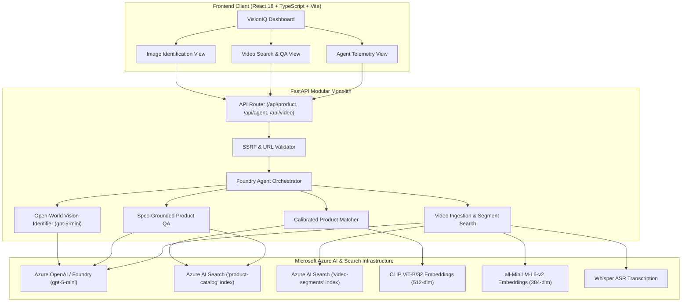

# VisionIQ — Multimodal Product & Video Intelligence Platform

[](https://azure.microsoft.com/)
[](https://fastapi.tiangolo.com/)
[](https://vitejs.dev/)
[](docs/responsible-ai.md)
[](tests/test_ssrf_protection.py)
[](LICENSE)

> **VisionIQ** is an AI-powered multimodal intelligence platform built on **Microsoft Azure AI Foundry**, **Azure AI Search**, and **Multimodal Foundation Models** (`gpt-5-mini`, CLIP ViT-B/32, and Whisper). It provides confidence-aware visual product identification, spec-grounded product Q&A, and temporal video moment retrieval.

---

## 👥 Team Members & Roles

| Name | Role & Core Responsibilities | GitHub / Profile |
| :--- | :--- | :--- |
| **Pranjal Sharma** | AI Architecture, Microsoft Foundry Agent & Full-Stack Integration | [@Pranjal-sh-git](https://github.com/Pranjal-sh-git) |
| **Dilpreet Singh** | Frontend UI/UX, Telemetry Views & Responsible AI Evaluation | Contributor |
| **Maneshwar Singh** | Multimodal Vision & Open-World Recognition Engineering | Contributor |
| **Garima** | Video Intelligence, ASR Indexing & Temporal Moment Retrieval | Contributor |
| **Paavni Ramdev** | Azure AI Search, Hybrid Vector Indexing & Evaluation Pipeline | Contributor |

---

## 📌 Overview

| Dimension | Implementation Summary |
| :--- | :--- |
| **Problem Addressed** | Conventional search struggles with open-world visual queries, uncataloged products, and unindexed video files, often producing false matches on out-of-catalog items or requiring manual scrubbing through videos. |
| **System Capabilities** | (1) **Open-World & Catalog Identification**: Identifies products from images/URLs with calibrated per-category thresholds; (2) **Spec-Grounded Product Q&A**: Answers queries strictly from verified catalog specifications; (3) **Temporal Video Search**: Indexes speech segments with Whisper ASR for timestamped moment retrieval and video Q&A; (4) **Web Dashboard**: React/TypeScript interface with live query execution. |
| **AI Technologies** | Microsoft Foundry Agent Tool Calling (Azure OpenAI `gpt-5-mini`), Azure AI Search vector indices (HNSW Cosine with CLIP ViT-B/32 and all-MiniLM-L6-v2), and Whisper ASR. |
| **Validation** | Benchmarked on a 100-image evaluation dataset (60 in-catalog + 40 sibling near-misses) and 15 video retrieval questions with documented Wilson score confidence intervals and automated security tests. |

---

## 🚀 Core Capabilities

### 1. 🔍 Confidence-Aware Product Identification
- **Open-World Recognition**: Extracts brand, model name, physical attributes, and category from uploaded images or remote URLs using Azure OpenAI vision (`gpt-5-mini`).
- **Calibrated Catalog Matching**: Uses CLIP ViT-B/32 512-dimensional vector embeddings with calibrated per-category confidence thresholds (`0.90` for Headphones, Chairs, Watches; `0.82` for Shoes) to minimize near-miss false positives.
- **Near-Miss Rejection**: Rejects sibling out-of-catalog items (e.g. audio mixers, sofas, work boots, pocket clocks) rather than forcing uncataloged items into incorrect product IDs.

### 2. 💬 Spec-Grounded Product Q&A
- **Structured Catalog Grounding**: Answers questions about catalog products using structured specification documents retrieved from Azure AI Search, refusing to invent unlisted specs or links.
- **Agent Tool Routing**: An Azure Foundry agent evaluates user intent and context to select appropriate tools (`identify_product`, `search_product_knowledge`, `search_video`, `find_similar_products`) via OpenAI function calling schemas.

### 3. 🎥 Temporal Video Retrieval & Q&A
- **Transcript Segment Indexing**: Transcribes uploaded video audio via Whisper ASR and indexes timestamped segments with 384-dimensional dense text embeddings (`all-MiniLM-L6-v2`) in Azure AI Search.
- **Timestamp-Cited Answers**: Resolves natural language video questions to exact time intervals (e.g. `[01:15 – 01:45]`) with grounded transcript citations and explicit refusal when topics are absent from the video.

### 4. 🎨 Modern Web Dashboard
- **React + TypeScript + Vite**: Responsive interface featuring image upload dropzones, catalog inspection drawers, video playback with timestamp seeking, and query telemetry.

---

## 🏗️ System Architecture


```mermaid
flowchart TD
    subgraph Client ["Frontend Client (React 18 + TypeScript + Vite)"]
        UI["VisionIQ Dashboard"]
        ImgView["Image Identification View"]
        VidView["Video Search & QA View"]
        ChatView["Agent Telemetry View"]
    end

    subgraph Backend ["FastAPI Modular Monolith"]
        Router["API Router (/api/product, /api/agent, /api/video)"]
        Agent["Foundry Agent Orchestrator"]
        Security["SSRF & URL Validator"]
        OpenWorld["Open-World Vision Identifier (gpt-5-mini)"]
        Matcher["Calibrated Product Matcher"]
        SpecQA["Spec-Grounded Product QA"]
        VideoEngine["Video Ingestion & Segment Search"]
    end

    subgraph AzureAI ["Microsoft Azure AI & Search Infrastructure"]
        Foundry["Azure OpenAI / Foundry (gpt-5-mini)"]
        AISearchProd["Azure AI Search ('product-catalog' index)"]
        AISearchVid["Azure AI Search ('video-segments' index)"]
        CLIP["CLIP ViT-B/32 Embeddings (512-dim)"]
        MiniLM["all-MiniLM-L6-v2 Embeddings (384-dim)"]
        Whisper["Whisper ASR Transcription"]
    end

    UI --> ImgView & VidView & ChatView
    ImgView & VidView & ChatView --> Router
    Router --> Security --> Agent
    Agent --> OpenWorld & Matcher & SpecQA & VideoEngine
    OpenWorld --> Foundry
    Matcher --> CLIP & AISearchProd
    SpecQA --> AISearchProd & Foundry
    VideoEngine --> Whisper & MiniLM & AISearchVid & Foundry
```

---

## 🧪 Benchmark Evaluation Results

The evaluation suite was executed against live Azure AI Search and Azure OpenAI endpoints. For complete methodology and confusion matrices, see [docs/evaluation.md](docs/evaluation.md).

### 1. Product Identification Benchmark (100 Images)
Evaluated on **100 test images** across 4 categories (Headphones, Chairs, Shoes, Watches):
- **60 In-Catalog test images** evaluated under challenging conditions (varied lighting, angles, complex backgrounds, in-use/worn).
- **40 Sibling Out-of-Catalog negative controls** (e.g., microphones, soundbars, bar stools, sofas, boots, pocket watches).

| Metric | Target Population | Computed Value | 95% Wilson Confidence Interval | Notes |
| :--- | :--- | :---: | :---: | :--- |
| **Top-1 Accuracy** | 60 In-Catalog Images | **40.0%** (24/60) | [28.57% – 52.63%] | Exact model match in rank 1 under varied conditions |
| **Top-3 Accuracy** | 60 In-Catalog Images | **65.0%** (39/60) | [52.36% – 75.83%] | Target product present in top-3 candidates |
| **In-Catalog Acceptance (TPR)** | 60 In-Catalog Images | **91.7%** (55/60) | [81.90% – 96.50%] | Correctly accepted without false rejection |
| **Near-Miss Rejection Rate** | 40 Sibling Controls | **87.5%** (35/40) | [73.89% – 94.54%] | Out-of-catalog sibling items correctly rejected |
| **Near-Miss False Positive Rate** | 40 Sibling Controls | **12.5%** (5/40) | [5.46% – 26.11%] | Reduced from 37.5% baseline via per-category thresholds |
| **Overall Pipeline Accuracy** | 100 Total Images | **59.0%** (59/100) | [49.20% – 68.13%] | Correct Top-1 match + Correct Rejection combined |

### 2. Per-Category Calibration Impact

| Category | Calibrated Threshold | Baseline FPR (`0.85`) | Calibrated FPR | In-Catalog Recall (TPR) | Sibling Controls Tested |
| :--- | :---: | :---: | :---: | :---: | :--- |
| **Headphones** | `0.90` | 60.0% (6/10) | **20.0%** (2/10) | 86.7% (13/15) | Studio microphones, mixers, soundbars |
| **Chairs** | `0.90` | 70.0% (7/10) | **20.0%** (2/10) | 86.7% (13/15) | Sofas, recliners, bar stools, desks |
| **Shoes** | `0.82` | 0.0% (0/10) | **0.0%** (0/10) | 93.3% (14/15) | Work boots, high heels, rollerblades |
| **Watches** | `0.90` | 20.0% (2/10) | **10.0%** (1/10) | 100.0% (15/15) | Pocket watches, alarm clocks, smart rings |

### 3. Video Retrieval & Q&A Benchmark (15 Questions)
Evaluated on **15 questions** (10 answerable in-video, 5 unanswerable out-of-video questions):
- **Timestamp Retrieval Accuracy**: **93.33%** (14/15)
- **Grounded Answer Correctness**: **86.67%** (13/15)
- **Unanswerable Refusal Rate**: **100.0%** (5/5 correctly refused without hallucination)

---

## 🛡️ Security & SSRF Protection

All image URL fetching flows (`identify_product`, visual embeddings, and open-world recognition) are protected by a dedicated security validation layer in [services/security.py](services/security.py):

| Security Control | Implementation Details |
| :--- | :--- |
| **Protocol Restriction** | Only `http://` and `https://` permitted; non-HTTP schemes (`file://`, `ftp://`, `gopher://`, `dict://`, etc.) rejected. |
| **Loopback & Localhost** | `127.0.0.0/8`, `::1`, and `localhost` strictly blocked. |
| **Private IP Protection** | RFC1918 subnets (`10.0.0.0/8`, `172.16.0.0/12`, `192.168.0.0/16`) and `fc00::/7` blocked. |
| **Cloud Metadata Protection** | `169.254.169.254`, `169.254.169.253`, `100.100.100.200`, and `metadata.google.internal` blocked. |
| **DNS Pre-Validation** | Resolves all candidate IPv4 and IPv6 addresses via `socket.getaddrinfo` before connection; blocks if any resolved IP is private/restricted. |
| **Per-Hop Redirect Inspection** | Disables automatic redirects (`allow_redirects=False`); re-validates hostname and resolved IPs at every redirect hop (max 4 hops). |
| **Resource Limits (DoS Protection)** | Enforces a **10 MB maximum download size** (`DEFAULT_MAX_IMAGE_SIZE_BYTES`) with Content-Length checking and streaming chunk limits. |
| **Strict Timeouts** | 5.0s connect timeout and 10.0s read timeout. |
| **Fail-Safe User Errors** | Raises `SSRFProtectionError` and returns HTTP 400 Bad Request without leaking internal stack traces. |

- **Security Test Suite**: **45 / 45 tests passing** in [tests/test_ssrf_protection.py](tests/test_ssrf_protection.py).
- **Integration & Route Test Suite**: **13 / 13 tests passing** across API endpoints and routing logic.

---

## 🛠️ Technology Stack

| Layer | Technologies | Purpose |
| :--- | :--- | :--- |
| **Agent Orchestration** | Azure OpenAI Foundry (`gpt-5-mini`) | Tool-calling, function routing, and grounded response synthesis |
| **Vision AI** | Azure OpenAI Vision (`gpt-5-mini`) | Open-world visual attribute and brand recognition |
| **Vector Search** | Azure AI Search (`product-catalog`, `video-segments`) | HNSW cosine vector search over product and video indices |
| **Embeddings** | CLIP ViT-B/32 (512-d) & all-MiniLM-L6-v2 (384-d) | Multimodal visual similarity and dense text retrieval |
| **Speech-to-Text** | OpenAI Whisper Tiny (`openai/whisper-tiny`) | Automatic speech recognition and video transcript chunking |
| **Backend API** | FastAPI / Python 3.10+ / Pydantic | Modular monolith REST API with CORS and startup model pre-warming |
| **Frontend** | React 18 / TypeScript / Vite | Responsive dashboard with video player and query telemetry |

---

## 📂 Project Structure

```text
visioniq/
├── frontend/                   # React + TypeScript + Vite web dashboard
│   ├── src/
│   │   ├── components/         # Navbar, VideoPlayer, ChatDrawer, UI controls
│   │   ├── pages/              # LandingPage, ImageIntelligence, VideoIntelligence
│   │   ├── services/           # Axios API client
│   │   ├── App.tsx             # Root application layout
│   │   └── index.css           # Vanilla CSS design system
│   ├── package.json
│   └── vite.config.ts
├── backend/                    # FastAPI backend server
│   ├── main.py                 # FastAPI entrypoint, CORS, lifespan startup pre-warming
│   ├── config.py               # Pydantic settings loading from .env
│   ├── routes/                 # API routers (/api/product, /api/video, /api/agent)
│   └── models/                 # Pydantic schemas for requests/responses
├── agent/                      # Azure Foundry Agent orchestration
│   ├── agent.py                # Agent execution loop and tool dispatcher
│   ├── tools.py                # Tool definitions (identify_product, search_product_knowledge, etc.)
│   └── prompts.py              # System prompts and grounding instructions
├── services/                   # Business logic and AI service modules
│   ├── security.py             # SSRF validation, IP filtering, safe image download
│   ├── vision/                 # Open-world visual identification service
│   ├── video/                  # Whisper transcription, segment indexing, temporal search
│   ├── product_search/         # CLIP embeddings and calibrated category matcher
│   ├── rag/                    # Spec-grounded catalog question answering
│   └── llm.py                  # Azure OpenAI client and grounded answer generator
├── data/                       # Catalog datasets, video caches, and benchmark artifacts
│   ├── products/               # Product catalog JSON data
│   ├── cache/video_analysis/   # Cached transcript chunks and keyframe metadata
│   └── evaluation/             # Evaluation CSV tables and markdown reports
├── docs/                       # Project Documentation
│   ├── architecture.md         # System architecture and data flow
│   ├── api.md                  # REST API reference
│   ├── evaluation.md           # Benchmark evaluation results and calibration analysis
│   └── responsible-ai.md       # Safety, grounding guidelines, and SSRF threat model
├── tests/                      # Automated test and evaluation suites
│   ├── test_ssrf_protection.py # 45 SSRF and security unit tests
│   ├── test_routes.py          # FastAPI endpoint integration tests
│   ├── test_agent_routing.py   # Agent tool routing tests
│   ├── test_health.py          # Health check and configuration tests
│   └── run_day4_evaluations.py # Evaluation benchmark suite runner
├── .env.example                # Sample environment variable template
├── requirements.txt            # Pinned Python dependencies
└── README.md                   # Project documentation
```

---

## ⚡ Quick Start & Setup

### Prerequisites
- **Python**: 3.10+
- **Node.js**: 18+ and npm
- **Azure Account**: Active Azure subscription with Azure OpenAI and Azure AI Search resources

### 1. Clone & Configure Environment

```bash
git clone https://github.com/Pranjal-sh-git/visioniq.git
cd visioniq

# Copy environment template
cp .env.example .env
```

Configure `.env` with your Azure credentials (never commit secrets to git):

```ini
# Azure OpenAI / Foundry
AZURE_OPENAI_ENDPOINT=https://<your-foundry-resource>.services.ai.azure.com/
AZURE_OPENAI_API_KEY=<your-azure-openai-key>
AZURE_OPENAI_DEPLOYMENT_NAME=gpt-5-mini
AZURE_OPENAI_API_VERSION=2024-06-01

# Azure AI Search
AZURE_SEARCH_ENDPOINT=https://<your-search-service>.search.windows.net
AZURE_SEARCH_KEY=<your-search-api-key>
AZURE_SEARCH_INDEX_NAME=product-catalog
```

### 2. Backend Setup

```bash
# Create and activate virtual environment
python -m venv .venv

# On Windows:
.venv\Scripts\activate
# On macOS/Linux:
source .venv/bin/activate

# Install dependencies
pip install -r requirements.txt

# Start backend server
uvicorn backend.main:app --reload --port 8000
```
- **Backend API**: `http://localhost:8000`
- **Interactive Swagger Docs**: `http://localhost:8000/docs`
- **Health Check**: `http://localhost:8000/api/health`

### 3. Frontend Setup

In a separate terminal:

```bash
cd frontend
npm install
npm run dev
```
- **Frontend Application**: `http://localhost:5173`

---

## 🧪 Running Automated Tests

```bash
# Run SSRF and security test suite (45 tests)
pytest tests/test_ssrf_protection.py

# Run API endpoint and routing integration tests (13 tests)
pytest tests/test_routes.py tests/test_health.py tests/test_agent_routing.py

# Run benchmark evaluation suite (generates data/evaluation/ artifacts)
python tests/run_day4_evaluations.py
```

---

## 📄 License & Responsible AI

VisionIQ is released under the [MIT License](LICENSE). For full details on data privacy, safety guardrails, and the SSRF threat model, review [docs/responsible-ai.md](docs/responsible-ai.md).
