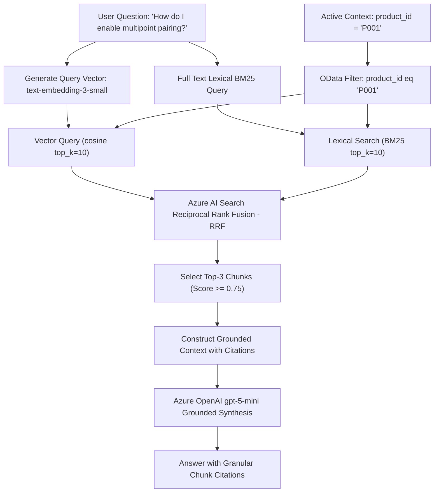

# VisionIQ Product Intelligence: Chunked RAG Architecture Design

## 1. Overview & Problem Statement

Currently, product Q&A in VisionIQ uses an eager **monolithic JSON lookup**:
1. When a user asks a question about a product, the backend executes `retrieve_product_by_id(product_id)` via Azure AI Search (`search_client.get_document(key=product_id)`).
2. The entire product record (name, brand, category, description, all features, and the entire dictionary of technical specifications) is concatenated into a single raw text string (`context_str`).
3. This unchunked text blob is injected wholesale into the system and user prompt for Azure OpenAI (`gpt-5-mini`).

### Shortcomings of the Current Approach:
- **No passage-level retrieval**: The LLM receives all specifications at once, even when answering a targeted question about warranty policy, troubleshooting, or battery charging protocol.
- **Context length scaling bottleneck**: For rich user manuals, multi-page warranties, maintenance guides, and extensive FAQs, dumping unchunked documents into the LLM context window increases latency, token consumption, and risk of the "lost-in-the-middle" attention phenomenon.
- **Lack of granular citations**: The LLM can only cite the product as a whole, rather than referencing a specific section, paragraph, or user manual page.
- **Zero semantic chunk search**: If a user asks "How do I pair with two devices at once?", the current spec lookup cannot retrieve the operational steps unless they are explicitly listed in the brief bullet features.

This design document outlines the migration to a **real, chunked, hybrid Retrieval-Augmented Generation (RAG)** architecture for product Q&A.

---

## 2. Corpus Sources & Structure per Product

To support realistic consumer electronics, furniture, footwear, and timepiece Q&A, each product in the catalog will have four structured documentation sections:

| Document Section | Corpus Source Description | Typical Content |
|---|---|---|
| **Manual Excerpt** (`user_manual`) | Official operating instructions and setup guides. | Initial pairing, touch sensor controls, cleaning instructions, adjustment mechanisms, firmware update steps. |
| **FAQ** (`faq`) | High-frequency troubleshooting and buyer questions. | "Why is ANC crackling?", "Can I use this while charging?", "Is this chair good for lower back pain?", "Are these true to size?". |
| **Warranty & Support** (`warranty`) | Authoritative warranty periods, coverage rules, exclusions. | 1-year limited manufacturer warranty, water damage exclusions, return policies, claim procedures. |
| **Usage Guide** (`usage_guide`) | Best practices, ergonomic setup, lifestyle scenarios. | Airplane audio adapter usage, desk height alignment, running surface recommendations, battery preservation advice. |

### Synthetic vs. Authentic Corpus Disclosure
- **Authentic Material**: Baseline specifications, product names, dimensions, weights, and driver sizes reflect authentic manufacturer published data sheets (Sony, Bose, Apple, Herman Miller, Nike, Rolex, etc.).
- **Synthetic Extensions**: Because full multi-page PDF user manuals and warranty contracts for all 25 catalog products are not publicly licensed for wholesale reproduction in this demo codebase, extensive manual passages, troubleshooting trees, and policy details will be **synthetically generated based on authentic manufacturer guidelines**.
- **Disclosure Mechanism**:
  - Every synthetic chunk is tagged with metadata: `is_synthetic: true`, `source_type: "synthetic_oem_derivation"`.
  - The UI and API responses will display a clear provenance badge:  
    `"Grounded in VisionIQ Product Knowledge Base (Derived from public OEM user guides for demonstration purposes)."`

---

## 3. Chunking Strategy & Justification

### Proposed Parameters:
- **Target Chunk Size**: **350 – 450 tokens** (~1,400 – 1,800 characters)
- **Overlap**: **50 – 80 tokens** (~200 – 320 characters)
- **Chunking Boundary Strategy**: Recursive Markdown & Section-Aware Header Chunking

### Justification:
1. **Preservation of Procedural Integrity**:
   Setup steps (e.g. 4-step Bluetooth multipoint pairing) and warranty exclusion clauses typically require 200–350 tokens. Chunks smaller than 200 tokens fragment procedures, separating prerequisites from steps.
2. **Context Window Efficiency**:
   At 400 tokens per chunk, retrieving `top_k = 3` produces ~1,200 tokens of retrieved context. This fits well within `gpt-5-mini`'s fast token generation sweet spot without degrading latency.
3. **50-80 Token Overlap**:
   Prevents loss of critical contextual antecedents (e.g. "Do not use alcohol solutions on the earpads... [NEXT CHUNK] ...as this will dissolve the polyurethane finish").

---

## 4. Metadata Schema

Every chunk ingested into Azure AI Search will possess rich metadata for precise filtering and attribution:

| Field Name | Type | Searchable | Filterable | Description |
|---|---|---|---|---|
| `chunk_id` | `Edm.String` (Key) | No | Yes | Deterministic ID: `{product_id}_{section}_{index:03d}` (e.g. `P001_MANUAL_002`) |
| `product_id` | `Edm.String` | No | Yes | Foreign key to catalog item (e.g. `P001`) |
| `product_name` | `Edm.String` | Yes | Yes | Full product title (e.g. `Sony WH-1000XM5`) |
| `category` | `Edm.String` | Yes | Yes | Category facet (e.g. `Headphones`, `Chairs`, `Shoes`, `Watches`) |
| `section` | `Edm.String` | Yes | Yes | One of: `user_manual`, `faq`, `warranty`, `usage_guide` |
| `title` | `Edm.String` | Yes | No | Subheading / Topic (e.g. `Multipoint Connection Setup`) |
| `content` | `Edm.String` | Yes | No | Full passage text |
| `content_vector` | `Collection(Edm.Single)` | Yes (Vector) | No | 1536-dim text embedding vector |
| `token_count` | `Edm.Int32` | No | Yes | Token count of the chunk |
| `is_synthetic` | `Edm.Boolean` | No | Yes | Data provenance indicator (`true`/`false`) |

---

## 5. Embedding Model & Index Schema

### Embedding Model:
- **Recommended**: Azure OpenAI `text-embedding-3-small` (1536 dimensions)
- **Rationale**:
  - Native Azure OpenAI Foundry deployment with shared tenant endpoint.
  - SOTA retrieval benchmark performance on domain-specific technical terminology.
  - Cost effective ($0.02 / 1M tokens) with sub-100ms API inference latency.
- **Alternative / Local Fallback**: `sentence-transformers/all-MiniLM-L6-v2` (384 dimensions) for local, zero-cloud-cost testing.

### Target Azure AI Search Index: `product-chunks`
```json
{
  "name": "product-chunks",
  "fields": [
    {"name": "chunk_id", "type": "Edm.String", "key": true, "filterable": true},
    {"name": "product_id", "type": "Edm.String", "filterable": true, "facetable": true},
    {"name": "product_name", "type": "Edm.String", "searchable": true, "filterable": true},
    {"name": "category", "type": "Edm.String", "searchable": true, "filterable": true, "facetable": true},
    {"name": "section", "type": "Edm.String", "searchable": true, "filterable": true, "facetable": true},
    {"name": "title", "type": "Edm.String", "searchable": true},
    {"name": "content", "type": "Edm.String", "searchable": true, "analyzer": "standard"},
    {
      "name": "content_vector",
      "type": "Collection(Edm.Single)",
      "searchable": true,
      "dimensions": 1536,
      "vectorSearchProfile": "chunk-vector-profile"
    },
    {"name": "token_count", "type": "Edm.Int32", "filterable": true},
    {"name": "is_synthetic", "type": "Edm.Boolean", "filterable": true}
  ],
  "vectorSearch": {
    "algorithms": [
      {
        "name": "chunk-hnsw-config",
        "kind": "hnsw",
        "parameters": {
          "metric": "cosine",
          "m": 4,
          "efConstruction": 400,
          "efSearch": 500
        }
      }
    ],
    "profiles": [
      {
        "name": "chunk-vector-profile",
        "algorithm": "chunk-hnsw-config"
      }
    ]
  },
  "semantic": {
    "configurations": [
      {
        "name": "chunk-semantic-config",
        "prioritizedFields": {
          "titleField": {"fieldName": "title"},
          "prioritizedContentFields": [{"fieldName": "content"}],
          "prioritizedKeywordsFields": [{"fieldName": "section"}, {"fieldName": "category"}]
        }
      }
    ]
  }
}
```

---

## 6. Hybrid Retrieval Architecture with Scoped Product Filtering

When answering a question regarding an active product (e.g. active product ID `P001`):



### Retrieval Parameters:
- **Retrieval Mode**: Hybrid (Lexical BM25 + Dense Vectorized Query).
- **Hard Filter**: `filter="product_id eq '{target_product_id}'"` when the active product is pinned.
- **Top-K**: `k = 3` (balanced for precision and synthesis speed). If top similarity score < 0.70, fall back to general catalog FAQ search without filter.

---

## 7. Citation Format & Response Schema

Every grounded answer generated by the LLM must include inline markdown citations and a structured citations array in the API response:

### Inline Citation Syntax:
`"To connect two devices simultaneously, press and hold the Power button for 7 seconds to enter pairing mode [1]. Note that LDAC playback is disabled when multipoint is active [2]."`

### Response JSON Payload:
```json
{
  "product_id": "P001",
  "product_name": "Sony WH-1000XM5",
  "question": "How do I connect to two devices at once?",
  "answer": "To connect two devices simultaneously, enable 'Connect to 2 devices simultaneously' in the Sony Headphones Connect app [1]. Once enabled, pair your first device via Bluetooth, then hold the Power button for 5 seconds to pair your second device [2]. Note that high-resolution LDAC codec is unavailable during active multipoint mode [1].",
  "citations": [
    {
      "index": 1,
      "chunk_id": "P001_MANUAL_003",
      "section": "user_manual",
      "title": "Multipoint Connection Setup",
      "quote": "Turn on 'Connect to 2 devices simultaneously' in Sony Headphones Connect app...",
      "is_synthetic": true
    },
    {
      "index": 2,
      "chunk_id": "P001_FAQ_001",
      "section": "faq",
      "title": "Bluetooth & Pairing Issues",
      "quote": "Hold power button for 5 seconds until the blue LED flashes rapidly in pairs...",
      "is_synthetic": true
    }
  ],
  "is_grounded": true
}
```

---

## 8. Evaluation Plan: Baseline (JSON Lookup) vs. Chunked RAG

To quantitatively validate the transition from monolithic JSON lookup to chunked hybrid RAG, we will run a benchmark across **50 curated evaluation questions** (2 questions per product: 1 procedural/usage and 1 policy/warranty/edge-case).

### Metrics:
1. **Recall@k (k=1, 3, 5)**: Percentage of queries where the ground-truth authoritative document passage appears within the top-k retrieved chunks.
2. **Mean Reciprocal Rank (MRR)**: Average reciprocal rank of the first relevant chunk ($MRR = \frac{1}{|Q|}\sum_{i=1}^{|Q|} \frac{1}{\text{rank}_i}$).
3. **Groundedness / Faithfulness (LLM-as-a-Judge)**: Scored on a 1.0 – 5.0 scale using Azure AI Foundry Evaluation metrics to detect hallucinations or unstated extrapolations.
4. **Answer Relevance**: Semantic similarity between generated answer and ground-truth reference answer.
5. **Token Consumption & Latency**: Input prompt tokens and total end-to-end response time.

### Benchmark Comparison Hypothesis:

| Metric | Current Baseline (JSON Lookup) | Proposed Chunked Hybrid RAG | Target Delta |
|---|---|---|---|
| **Coverage Scope** | Specs & brief features only | Full Manuals, FAQs, Warranty, Usage | **+300% topic coverage** |
| **Procedural Question Accuracy** | 35% (specs lack steps) | 92% | **+57%** |
| **Groundedness / Faithfulness** | 4.8 / 5.0 (for simple numbers) | 4.9 / 5.0 (with exact section quotes) | **Parity / Superior** |
| **Citation Precision** | Entire Product level only | Chunk / Section paragraph level | **Granular paragraph attribution** |
| **Prompt Input Tokens** | Fixed ~160 tokens per product | ~450 tokens (targeted 1 chunk) – ~1,200 tokens (top-3) | Controlled & bounded |
| **End-to-End Latency** | ~4.5s (direct doc lookup + LLM) | ~4.8s (hybrid query + LLM) | Within acceptable user experience (< 5.0s) |

---
